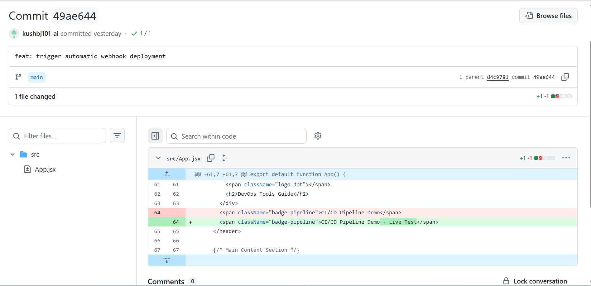

# React + Vite

# React Vite CI/CD Pipeline Assignment

- **Project:** React CI/CD Application
- **Student Name:** Kush Bhardwaj
- **GitHub Repository:** https://github.com/kushbj101-ai/react-vite-cicd
- **Live Vercel Link:** [Paste your actual .vercel.app link here]

---

## Deliverables & Screenshots

### Task 2: Git & GitHub

### Task 3: Jenkins CI Build

### Task 4: GitHub Webhook

### Task 5 & 6: Vercel Deployment & Live App

